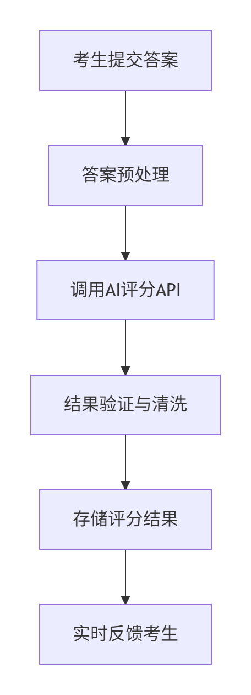
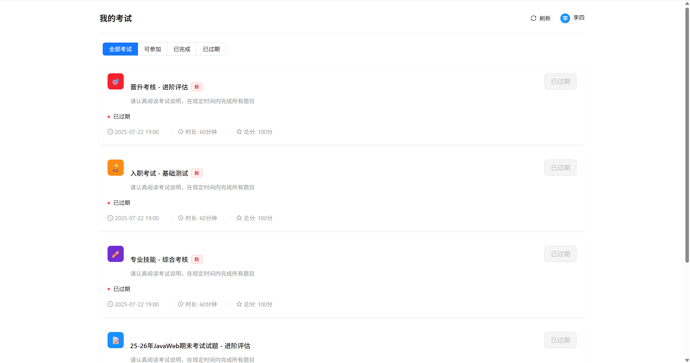
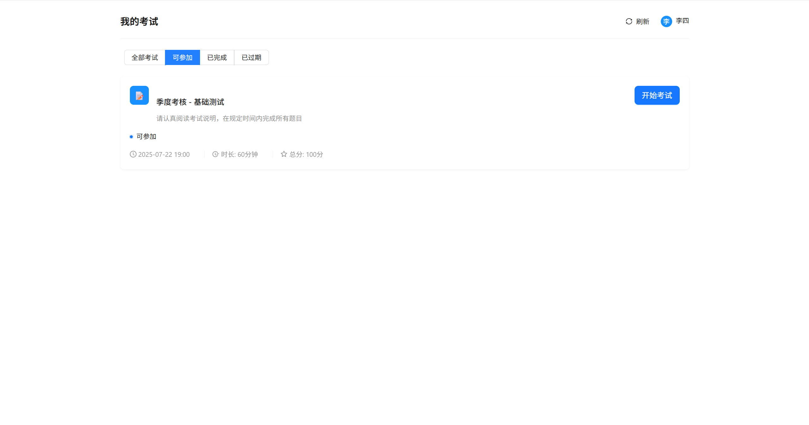
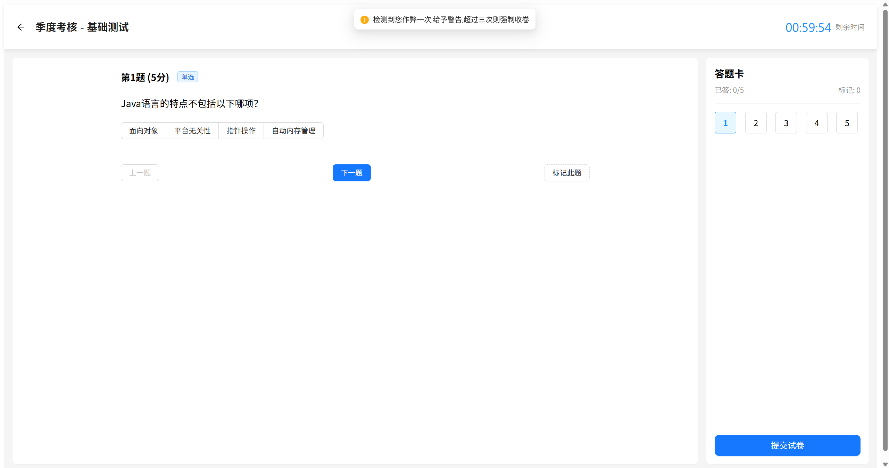

# AI 智能判题系统 - 在线考试平台

## 引言

在数字化教育迅猛发展的今天，智能化考试评估系统正成为教育技术领域的重要创新。本项目基于 SpringBoot 和 Vue3 构建了一个功能全面的在线判题系统，不仅支持传统题型，还创新性地整合了 AI 智能评分技术，为教育评估提供了全新的解决方案。

## 项目概览

### 系统特色

- 智能化评分体系 ​​：采用先进 AI 技术对主观题进行自动评分，支持多种评分模式配置
- 多元化题型支持 ​​：全面覆盖单选题、多选题、判断题、填空题和简答题
- 灵活的多选题评判 ​​：提供三种评分策略，满足不同考试场景需求
- 严格的防作弊机制 ​​：实时监控考试环境，确保考试公平性
- 数据驱动的分析 ​​：提供详细的考试数据分析，助力教学改进

## 功能详解

### 1. AI 智能评分系统



### 2.多选题评分模式


### 3. 防作弊系统

- 实时窗口监控 ​​：检测页面焦点状态
- 行为异常识别 ​​：分析答题行为模式
- 三级预警机制 ​​：

1. 首次违规：警告提示
2. 二次违规：记录标记
3. 三次违规：强制收卷

## 系统截图

### 项目首页

简洁直观的界面设计，方便用户快速导航


### 考试列表

清晰展示可参加的考试信息，包括时间、题型和难度


### 考试界面

现代化的答题界面，支持多种题型展示，实时的作弊行为检测和警告提示


## 技术架构

### 后端技术栈

- 核心架构: SpringBoot
- 数据持久化: MySQL + MyBatis Plus
- API文档: Knife4J
- AI集成: LangChain4j
- 缓存(消息队列): Redis
- 密码加密: jbcrypt
- 模型: DeepSeek

### 前端技术栈
- 核心组件: Vue
- UI组件: Ant Design Vue
- 路由管理: Vue Router 4
- Http客户端: Axios

## 部署指南
### 环境要求
* JDK 17+
* Node.js 16+
* MySQL 8.0+
* Redis 6.0+

## 快速启动
1. 后端部署
```shell
mvn clean package
java -jar target/exam-system.jar
```
2. 前端部署
```shell
npm install
npm run build
```

## 未来规划
* 题型扩展：增加编程题、听力题等题型支持
* AI优化：引入多模型对比评分，提高评分准确性
* 数据分析：深化考试数据挖掘，提供个性化学习建议
* 安全增强：增加人脸识别、行为分析等防作弊手段
* 移动适配：优化移动端体验，支持随时随地考试

## 贡献指南
欢迎通过以下方式参与项目贡献：
* 提交Issue报告问题或建议
* Fork项目并提交Pull Request
* 完善项目文档和测试用例
* 分享使用案例和经验